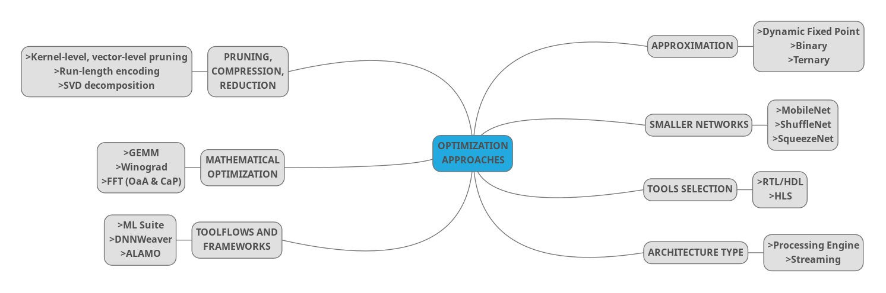

The various possible ways to accelerate and optimize the inference of neural networks, with specific focus on CNNs, are gathered under the coming headings. It was intended to keep each heading restricted to an aspect that comprises of disjoint options; however, more than one aspect may be incorporated at a time, for optimization:

- Smaller Networks
    
- Mathematical optimization
    
- Approximation
    
- Pruning, Compression, Reduction
    
- Tool (Verilog, HLS)
    
- Streaming or Processing Engines
    
- ​ 
  

## 1. Smaller Networks
To reduce the computations, networks were developed that had lesser computations per layer or less layers altogether. MobileNet uses depth separable convolutions to reduce computations[^1] MobileNet v2 incorporated pointwise convolutions before depth separable convolutions, named separable bottleneck layer[^2]. Inception introduced a bottleneck layer along-with pointwise convolutions[^3]. Xception, a variant of Inception, introduced depth wise separable layer[^4]. Resnet further employed bottleneck layer[^5]. Rexnet employed group convolutions[^6]. ShuffleNet introduced channel shuffle[^7]. Group convolutions were used in ShuffleNet and ResNeXt, allowing to train a neural network across multiple GPUs[^8]. EffNet further used pointwise, depth-wise separable and spatially separated convolutions[^9]. SqueezeNet, using Fire Module makes use of 1x1 convolutions among other techniques (pruning, compression, quantization)[^10].

  

## 2. Mathematical Optimization
Numerical optimization of calculations are more mature for libraries with large community and ease of application, as is the case for CUDA, openBLAS, OpenCL/GL. These are used primarily for GPUs and processors. FPGA and ASIC accelerators may also adopt the calculation optimizations, but the burden of implementation remains on the designer, for which libraries are not be found in abundance contrary to CPU, GPU programming libraries. Convolutions may be mapped as GEMM (General Matrix Multiplication)[^11]. Another variant of it, uses a form of Toeplitz Matrix[^12]. This particular approach may lead to redundancy in convolution layers but suits fully connected layers. Another approach is to use FFT to carry out convolutions as multiplications in the frequency domain reducing the complexity, which can be further reduced by incorporating an Overlap and Add (OaA) technique in FFT[^11]. Further Concatenate and Pad (CaP) may reduce the redundancy as well[^13]. Winograd Transform has also been used for convolution[^11]. Strassen Algorithm, if used, can help reduce computational workload of matrix multiplications, converting them to additions and subtractions[^14]

  

## 3. Approximate Arithmetic/Quantization
The weights, activations and intermediate values (Feature Map/ FM values) are mostly used as float in CPUs and GPUs, however reducing the precision may not cause much accuracy loss, trading for a reduced memory footprint on an ASIC or FPGA, which is a major constraint for FPGAs. Weights and/or activations are quantized then used in the network, sometimes after fine-tuning, i.e. by training them in the network once again. Dynamic fixed-point precision is preferred over static fixed point[^12]. 8-bit weights and 10-bit activations have been adopted with and without fine-tuning with minor drop in accuracy[^11]. Xilinx released a whitepaper establishing that, 8-bits are enough, with a minimal decrease in accuracy[^15].

More drastic quantization techniques have been explored as well that bring the precision down to less than 3 bits. BinaryConnect has float activations with 1-bit weights (+1,-1)[^16]. BWN uses quantization to a single value with two polarities (+w, -w) i.e 1 bit but with scale factor, for the weights only, with the exception of the first layer and last layer[^17]. TWN instead allows the weights to be zero as well (+w, 0, -w)[^18]. TTQ has a different scale for each weight (w1, 0, w2)[^19]. XNOR-Net reduces both to 1-bit for middle layers[^17]. BNN adopts 1-bit weights and activations for all layers[^20]. DoReFa-Net, QNN, HWGQ-Net make use of 1-bit weights and 2-bit activations[^12]. LogNet[^21], INQ[^22] count as the non-linear quantization approaches.

Xilinx’s ML Suite provides options for INT8/INT16 quantization are part of its framework tools. Frameworks for TensorFlow and Caffe are also available to finding the optimal precision and fine-tuning the network. Ristretto (RTL based, Caffe) aids in quantization with different scale factors[^11]. Different scaling factors are also supported by Angel-Eye, ALAMO, DNNWeaver, DeepBurning, AutoCodeGen toolflows along with dynamic quantization[^23].

In a different approach, a neural network is forced to have a limited number of unique weights, essentially sharing those limited number of weights across the network[^24] which can be looked up from LUTs (FPGA).

  

## 4. Pruning, Compression, Reduction
Reducing the number of weights altogether comes under this heading, as weights fairly close to zero are redundant, therefore they may be discarded without much loss to accuracy. Aggressive training may be carried out as well combined with fine-tuning[^11]. Random pruning may make memory accesses unusual requiring hardware re-design[^23], therefore structured pruning has been explored. Fine-grained, vector-level, kernel-level, group-level and filter-level pruning have been explored.

Weights may be encoded to reduce storage requirement[^12]. Run-Length Encoding has been explored in Eyeriss architecture[^25]. ZFNaf, RoE, VIAI are among others explored in the Cnvlutin2 accelerator[^26]. Huffman coding is used in Deep Compression[^27]. EIE, hardware accelerator directly operates on compressed models[^28].

Representing filters as combination of smaller filters help speed up the convolution and is termed low-rank approximation/decomposition, for which Principal Component Analysis or Singular Value Decomposition (SVD) may be used[^11]. The approaches to decomposition can be categorized into Two-Component, Three-Component (Tucker, Block Term - BTD) and Four-Component (Canonical Polyadic – CP)[^29].

## 5. Tool (Verilog/ HLS)

RTL-based designs tend to outperform their HLS counterparts in terms of energy efficiency, memory utilization and throughput[^23]. However, HLS offers quicker design speed and more reconfigurability.

RTL-based designs may need major re-design in the case of a change in algorithm, if they are designed in a specific manner to that algorithm[^30].

  

## 6. Streaming vs Processing Engines
Hardware architectures are mainly either streaming, in which the whole of CNN is mapped onto the FPGA fabric, or, processing engines, in which a basic processing unit is used over and over again[^23]. Systolic array is also one of the approaches explored[^11].

## 7. Toolflows and Frameworks

Xilinx provides ML Suite for deployment of neural networks having xDNN (neural network processing unit) and xfDNN middleware, providing support for TensorFlow and Caffee.

Intel released OpenVINO, also with support for popular frameworks. Toolflows for mapping CNN to FPGA with support for Caffe include fpgaConvNet, DeepBurning, Angel-Eye, ALAMO, Haddoc2, DNNWeaver and Caffeine. Some other toolflows having support for different frameworks are AutoCodeGen, FINN, FP-DNN, Snowflake, SysArrayAccel and FFTCodeGen[^23].

 
[^1]: M. Z. B. C. D. K. W. W. T. W. M. A. a. H. A. A. G. Howard, "Mobilenets: Efficient Convolutional Neural Networks for Mobile Vision Applications," 2017.
[^2]: A. H. M. Z. A. Z. a. L. C. M. Sandler, "MobileNetV2: Inverted Residuals and Linear Bottlenecks," 2018.|
[^3]: W. L. Y. J. P. S. S. R. D. A. D. E. V. V. A. R. Christian Szegedy, "Going deeper with convolutions," 2014.|
[^4]: F. Chollet, "Xception: Deep Learning with Depthwise Separable Convolutions," 2017.|
[^5]: X. Z. S. R. J. S. Kaiming He, "Deep Residual Learning for Image Recognition," 2015.|
[^6]: R. G. P. D. Z. T. a. K. H. S. Xie, "Aggregated Residual Transformations for Deep Neural Networks," 2017.|
[^7]: X. Z. M. L. a. J. S. X. Zhang, "ShuffleNet: An Extremely Efficient Convolutional Neural Network for Mobile Devices," 2017.|
[^8]: S. G. E. H. Alex Krizhevsky, "ImageNet Classification with Deep Convolutional Neural Networks," 2012.|
[^9]: L. R.-K. A. K. Ido Freeman, "EffNet: AN EFFICIENT STRUCTURE FOR CONVOLUTIONAL NEURAL NETWORKS," 2018.|
[^10]: S. H. M. W. K. A. W. J. K. K. Forrest N.Iandola, "SQUEEZENET: ALEXNET-LEVEL ACCURACY WITH 50X FEWER PARAMETERS AND <0.5MB MODEL SIZE," 2016.|
[^11]:M. P. J. S. F. B. Kamel Abdelouahab, "Accelerating CNN inference on FPGAs: A Survey," 2018.|
[^12]: S. M. I. Y.-H. C. S. M. I. T.-J. Y. S. M. I. J. E. F. I. Vivienne Sze, "Efficient Processing of Deep Neural Networks: A Tutorial and Survey," 2017.|
[^13]:H. &. C. R. &. Z. C. &. P. V. Zeng, "A Framework for Generating High Throughput CNN Implementations on FPGAs," 2018.|
[^14]: J. C. a. B. Xiao, "Minimizing Computation in Convolutional Neural Networks," 2014.|
[^15]: E. W. A. S. S. A. K. K. a. R. W. Yao Fu, "Deep Learning with INT8 Optimization on Xilinx Devices," 2017.|
[^16]: Y. B. a. J.-P. D. M. Courbariaux, "Binaryconnect: Training deep neural networks with binary weights during propagations," 2015.|
[^17]: V. O. J. R. a. A. F. M. Rastegari, "XNORNet: ImageNet Classification Using Binary Convolutional Neural Networks," 2016.|
[^18]: F. L. a. B. Liu, "Ternary weight networks," 2016.|
[^19]: S. H. H. M. a. W. J. D. C. Zhu, "Trained Ternary Quantization," 2017.|
[^20]: M. C. a. Y. Bengio, "Binarynet: Training deep neural networks with weights and activations constrained to +1 or -1," 2016.|
[^21]: E. H. L. a. B. M. D. Miyashita, "Convolutional Neural Networks using Logarithmic Data Representation," 2016.|
[^22]: A. Y. Y. G. L. X. a. Y. C. A. Zhou, "Incremental Network Quantization: Towards Lossless CNNs with Lowprecision Weights," 2017.|
[^23]: A. K. A. C.-S. B. STYLIANOS I. VENIERIS, "Toolflows for Mapping Convolutional Neural Networks on FPGAs: A Survey and Future Directions," 2018.|
[^24]: J. T. S. T. K. Q. Y. C. Wenlin Chen, "Compressing Neural Networks with the Hashing Trick," 2015.|
[^25]: T. K. J. E. a. V. S. Y.-H. Chen, "Eyeriss: An energy-efficient reconfigurable accelerator for deep convolutional neural networks," 2016.|
[^26]: A. D. S. S. &. A. M. Patrick Judd, "Cnvlutin2: Ineffectual-Activation-and-Weight-Free Deep Neural Network Computing," 2017.|
[^27]: H. M. W. J. D. Song Han, "DEEP COMPRESSION: COMPRESSING DEEP NEURAL NETWORKS WITH PRUNING, TRAINED QUANTIZATION AND HUFFMAN CODING," 2016.|
[^28]: X. L. H. M. J. P. A. P. M. A. H. W. J. D. Song Han, "EIE: Efficient Inference Engine on Compressed Deep Neural Network," 2016.|
[^29]: Y. G. M. R. I. O. a. V. L. Vadim Lebedev, "SPEEDING-UP CONVOLUTIONAL NEURAL NETWORKS USING FINE-TUNED CP-DECOMPOSITION," 2015.|
[^30]: N. S. Y. C. J.-s. S. S. V. Yufei Ma, "Scalable and Modularized RTL Compilation of Convolutional Neural Networks onto FPGA," 2016.|
[^31]: Y. Xie, "A Brief Guide of xPU for AI Accelerators," 2018. [Online]. [Accessed 2019].|
[^32]: S. Z. J. Y. Y. W. A. H. Y. KAIYUAN GUO, "A Survey of FPGA Based Neural Network Accelerator," 2017.|
